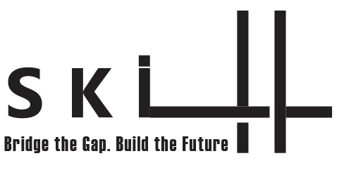

# Skill-Bridge_AI_tool

<p align="center">
  
</p>

	⁠Bridging the gap between human expertise and AI capabilities

## 📖 Table of Contents

•⁠  ⁠[Vision](#vision)
•⁠  ⁠[Approach](#approach)
•⁠  ⁠[Features](#features)
•⁠  ⁠[Core Functions](#core-functions)
•⁠  ⁠[Installation](#installation)
•⁠  ⁠[Usage](#usage)
•⁠  ⁠[Requirements](requirements)
•⁠  ⁠[License](#license)
•⁠  ⁠[Authors](#authors)

## 🔭 Vision

Skill-Bridge AI is designed to revolutionize how professionals and organizations leverage artificial intelligence. Our vision is to create a seamless bridge between human expertise and AI capabilities, enabling users to:

•⁠  ⁠Translate domain-specific knowledge into actionable AI skills
•⁠  ⁠Democratize access to AI technology across all skill levels
•⁠  ⁠Create persistent, reusable AI skills that evolve with user feedback
•⁠  ⁠Build an ecosystem of shareable skills that enhance collective intelligence

We believe AI should be an extension of human capability rather than a replacement, augmenting expertise in ways that respect human agency and wisdom while expanding our collective problem-solving capacity.

## 🏗️ Approach

Skill-Bridge employs a multi-layered architecture that transforms human knowledge into executable AI skills:

### 🔹 Skill Identification (NER)
- Extracts skills from job listings using a custom-trained Named Entity Recognition model based on SpaCy.
- Embedding techniques include Word2Vec and GloVe.
- Evaluated with IoU, semantic similarity, and precision.

### 🔹 Course Recommendation (RAG)
- Uses a Retrieval-Augmented Generation pipeline powered by sentence-transformers, Pinecone, and Cohere.
- Retrieves online courses to fill skill gaps based on similarity with job and user profile embeddings.
- Requires API keys for Pinecone and Cohere.
•⁠  ⁠Contextual understanding (when and how to apply skills)

## 🌟 Features

• Skill extraction from job descriptions  
• Compatibility scoring between users and jobs  
• Personalized course recommendations  
• Glassdoor job scraping for real-world data  
• Visual performance analysis  
• Modular Jupyter Notebooks for easy experimentation

## 🧠 Core Components

### 📘 AI_Architectures/NER_model.ipynb
- Trains a custom NER model using annotated job descriptions.
- Evaluates multiple embedding methods.
- Can also load pre-trained models for evaluation and inference.

### 📘 AI_Architectures/RAG_architecture.ipynb
- Embeds course data and creates a Pinecone index.
- Queries the vector database to find relevant courses for a job-user pair.
- Evaluates recommendation quality based on skill compatibility improvement.
- **Note:** API keys must be added manually for Pinecone and Cohere.

### 📘 Scraping_Data/scraping_jobs_info.ipynb
- Scrapes over 17,000 job listings from Glassdoor using Selenium and BeautifulSoup.
- Collects jobs by querying 3,000 random companies from a dataset.
- Data used for fine-tuning the NER model.

### 📘 Data_Preprocessing/Users Preprocessing.ipynb
- Consolidates user experience data into a clean, textual format for analysis.

### 📘 Data Analytics/Data Analytics.ipynb
- Provides visual and statistical evaluations before model training.

## 🚀 Installation

```bash
git clone https://github.com/RanSela-033/Skill-Bridge_AI_tool.git
cd Skill-Bridge_AI_tool
pip install -r requirements.txt
```

## 💻 Usage

Run the notebooks in this order:

1. `Scraping_Data/scraping_jobs_info.ipynb`
2. `Data_Preprocessing/Users Preprocessing.ipynb`
3. `AI_Architectures/NER_model.ipynb`
4. `AI_Architectures/RAG_architecture.ipynb`
5. `Data Analytics/Data Analytics.ipynb`

## 📦 Requirements

See `requirements.txt` for a full list of required packages.


## 👥 Authors

Bar Muller, Bar Redel, Ran Sela  
Technion – Israel Institute of Technology
