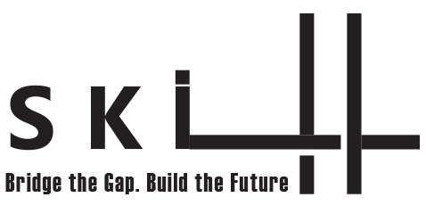

# Skill-Bridge_AI_tool

<p align="center">
  
</p>

Bridging the gap between job seekers and the AI tools that connect them to opportunity.

## 📖 Table of Contents

• [Vision](#vision)  
• [Approach](#approach)  
• [Features](#features)  
• [Core Components](#core-components)  
• [Installation](#installation)  
• [Usage](#usage)  
• [Requirements](#requirements)  
• [License](#license)  
• [Authors](#authors)

## 🔭 Vision

Skill-Bridge AI is designed to empower job seekers by evaluating their fit for job opportunities and recommending personalized learning paths to close skill gaps. We aim to democratize access to career development tools by combining machine learning with real-world employment data and high-quality online courses.

## 🏗️ Approach

We use a two-part architecture:

### 🔹 Skill Identification (NER)
- Extracts skills from job listings using a custom-trained Named Entity Recognition model based on SpaCy.
- Embedding techniques include Word2Vec and GloVe.
- Evaluated with IoU, semantic similarity, and precision.

### 🔹 Course Recommendation (RAG)
- Uses a Retrieval-Augmented Generation pipeline powered by sentence-transformers, Pinecone, and Cohere.
- Retrieves online courses to fill skill gaps based on similarity with job and user profile embeddings.
- Requires API keys for Pinecone and Cohere.

## 🌟 Features

• Skill extraction from job descriptions  
• Compatibility scoring between users and jobs  
• Personalized course recommendations  
• Glassdoor job scraping for real-world data  
• Visual performance analysis  
• Modular Jupyter Notebooks for easy experimentation

## 🧠 Core Components

### 📘 AI_Architectures/NER_model.ipynb
- Trains a custom NER model using annotated job descriptions.
- Evaluates multiple embedding methods.
- Can also load pre-trained models for evaluation and inference.

### 📘 AI_Architectures/RAG_architecture.ipynb
- Embeds course data and creates a Pinecone index.
- Queries the vector database to find relevant courses for a job-user pair.
- Evaluates recommendation quality based on skill compatibility improvement.
- **Note:** API keys must be added manually for Pinecone and Cohere.

### 📘 Scraping_Data/scraping_jobs_info.ipynb
- Scrapes over 17,000 job listings from Glassdoor using Selenium and BeautifulSoup.
- Collects jobs by querying 3,000 random companies from a dataset.
- Data used for fine-tuning the NER model.

### 📘 Data_Preprocessing/Users Preprocessing.ipynb
- Consolidates user experience data into a clean, textual format for analysis.

### 📘 Data Analytics/Data Analytics.ipynb
- Provides visual and statistical evaluations before model training.

## 🚀 Installation

```bash
git clone https://github.com/RanSela-033/Skill-Bridge_AI_tool.git
cd Skill-Bridge_AI_tool
pip install -r requirements.txt
```

## 💻 Usage

Run the notebooks in this order:

1. `Scraping_Data/scraping_jobs_info.ipynb`
2. `Data_Preprocessing/Users Preprocessing.ipynb`
3. `AI_Architectures/NER_model.ipynb`
4. `AI_Architectures/RAG_architecture.ipynb`
5. `Data Analytics/Data Analytics.ipynb`

## 📦 Requirements

See `requirements.txt` for a full list of required packages.


## 👥 Authors

Bar Muller, Bar Redel, Ran Sela  
Technion – Israel Institute of Technology
